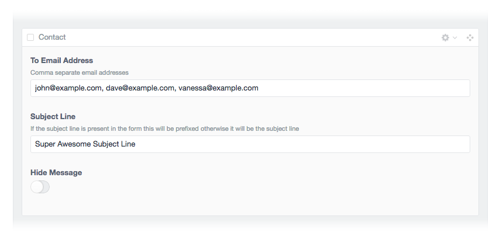
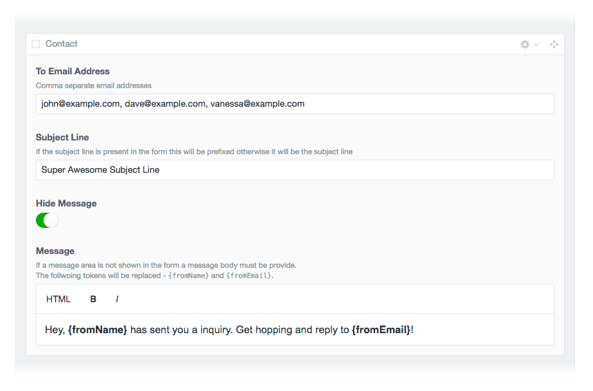

# Contact Form Plus plugin for Craft CMS

Power up the Pixel &amp; Tonic Contact Form plugin!

## Installation

To install Contact Form Plus, follow these steps:

1. Download & unzip the file and place the `contactformplus` directory into your `craft/plugins` directory
2.  -OR- do a `git clone https://github.com/fyrebase/contactformplus.git` directly into your `craft/plugins` folder.  You can then update it with `git pull`
3.  -OR- install with Composer via `composer require fyrebase/contactformplus`
4. Install plugin in the Craft Control Panel under Settings > Plugins
5. The plugin folder should be named `contactformplus` for Craft to see it.  GitHub recently started appending `-master` (the branch name) to the name of the folder for zip file downloads.

Contact Form Plus works on Craft 2.6.x.

## Contact Form Plus Overview

Contact Form Plus enables you to re-use the Pixel & Tonic Contact Form throughout your site assigning different subject lines and to email addresses. It also provides the ability to hide the message area from the front end templates when it is not required.

Works within **Matrix** and **Neo** blocks!

## Using Contact Form Plus

Using the fieldtype is straight forward

## Contact Form Plus Template Code

### Rendering the Contact Form Plus hidden fields

    {{ el.contactForm.hiddens }}

or alternatively

    {{ el.contactForm.getHiddens() }}

### Check if the message is to be displayed

    ...

or alternatively

    ...

### Full contact form example:

    
        
            <ul class="errors">
                
                    <li>{{ error }}</li>
                
            </ul>
        
    

    

    <form method="post" action="" accept-charset="UTF-8">
        {{ getCsrfInput() }}
        <input type="hidden" name="action" value="contactForm/sendMessage">
        <input type="hidden" name="redirect" value="contact/thanks">
        {{ el.contactForm.hiddens }}

        <h3><label for="fromName">Your Name</label></h3>
        <input id="fromName" type="text" name="fromName" value="{{ message.fromName }}">
        {{ message is defined and message ? errorList(message.getErrors('fromName')) }}

        <h3><label for="fromEmail">Your Email</label></h3>
        <input id="fromEmail" type="email" name="fromEmail" value="{{ message.fromEmail }}">
        {{ message is defined and message ? errorList(message.getErrors('fromEmail')) }}

        <h3><label for="subject">Subject</label></h3>
        <input id="subject" type="text" name="subject" value="{{ message.subject }}">
        {{ message is defined and message ? errorList(message.getErrors('subject')) }}

        <h3><label for="telephone">Telephone</label></h3>
        <input id="telephone" type="text" name="message[telephone]" value="">

        
            <h3><label for="message">Message</label></h3>
            <textarea rows="10" cols="40" id="message" name="message[body]">{{ message.message }}</textarea>
            {{ message is defined and message ? errorList(message.getErrors('message')) }}
        

        <input type="submit" value="Send">
    </form>

## Contact Form Plus Roadmap

Some things to do, and ideas for potential features:

* Release it

## Contact Form Plus Changelog

### 0.0.1 -- 2016.10.01

* Initial release

Brought to you by [Fyrebase](http://fyrebase.com)
